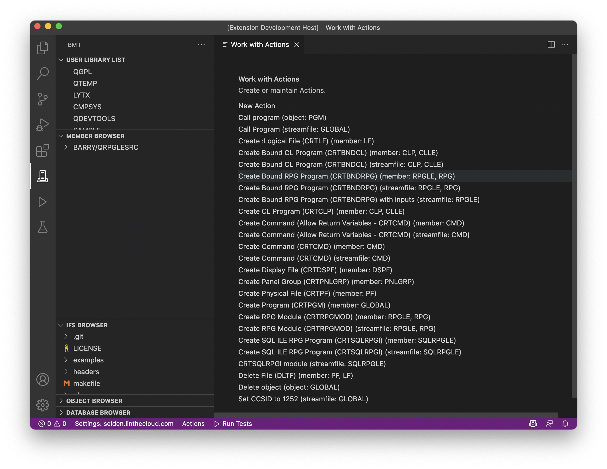
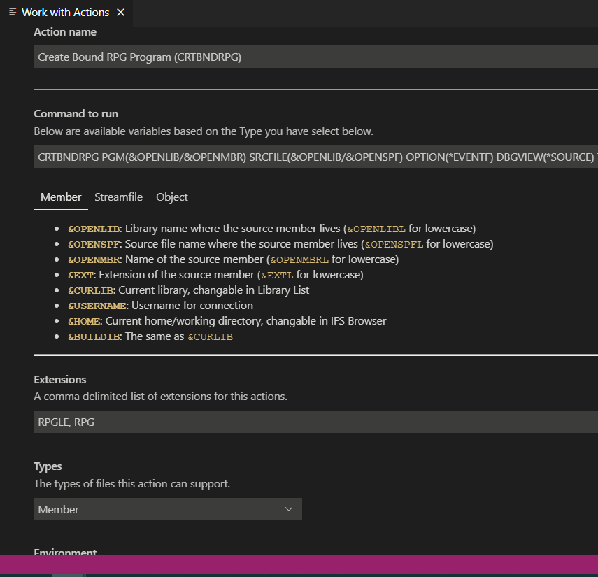

#

# Creating an Action

After you have opened the Actions panel, you have two options:

* You can create a new Action by pressing the 'New Action' item at the top of the list (which is always at the top)
* Press on an existing Action from the list to edit and update it.

To keep creating and maintaining, you will see the same view for creating or editing Actions.

In this example, we are editing 'Create Bound RPG Program (CRTBNDRPG)'. We are able to change any of the properties.

* '**Command**' is the command that will be executed. You will notice is has portions of text that start with an `&` (ampersand) - that is a variable. There are many variables, so you should [check out the documentation page](https://halcyon-tech.github.io/vscode-ibmi/#/?id=command-variables-and-fields) for more information. Commands can have different variables based on what 'Type' (member, streamfile, object) you give it.
* '**Extension**' defines what list of extensions can use this Action. For `CRTBNDRPG`, that usually means only `RPGLE` and `RPG`, so we would write: `RPGLE, RPG`.
* '**Type**' determines which type of object can run this. For example, if your Action only applies to source members, then you would choose 'Member'.
* '**Environment**' determine where the command should be run. In this case, `CRTBNDRPG` needs to run in the ILE environment since it's an ILE command. You also have the option to run commands thtough PASE or QShell.

When you are ready to create/save your Action, **click Save**. If you close the tab, it will not save.

## Compile errors

Note, if you're running a command to compile source code into a object and want to errors to show up in the Problems tab, you need to make sure your command has `OPTIONS(*EVENTF)`. All of the default commands will have this.