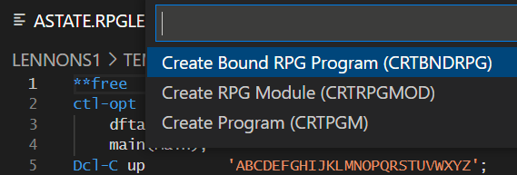

#

## Running an Action

To run an Action, open a source member (or IFS streamfile) and press the shortcut key:

* Windows: Control + E
* Mac: Command + E

This shows a dropdown of the available Actions for the open file. Use the arrow keys to select which Action to run and hit enter to select it.

Example: to run the 'CRTBNDRPG' Action, you must open a source member with either `RPG` or `RPGLE` as the extension. Then, when you use the Run Action shortcut (above), you will see the list of available Actions:
.

