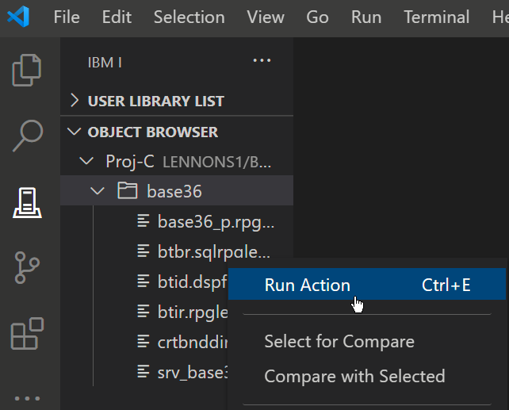

#

## Running an Action

It is also possible to run an Action against a source member, IFS or object without opening it up.

If you right click on the source member, you will see `Run Action` as an option.

Like before, it will show a list of available Actions that can be run on that source member in the box that appears.

