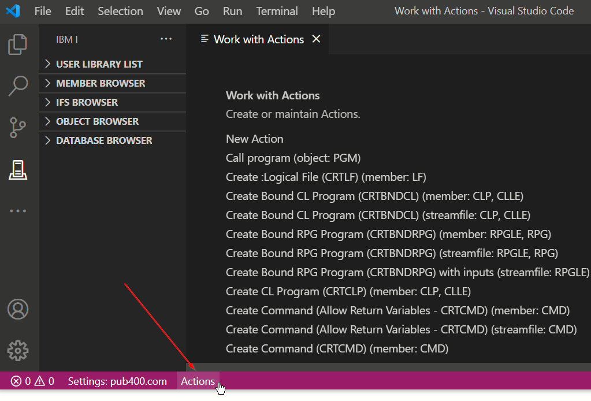

#

# What are Actions

Actions are defined commands that can be executed from two different places:

* As you're writing code. For example, to compile a program or module.
* When you right click on a member, streamfile or an object from the object browser.

# Viewing Actions

To view a list of actions you have defined, you can press the Actions button on the Status Bar at the bottom.

The Action list is alphabetical, regardless of what the properties of that action are. Though, you can see what types it is targetting.