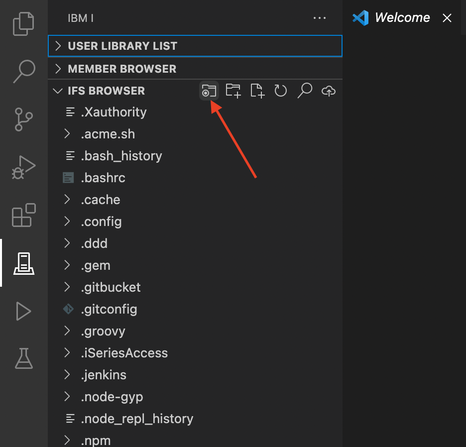

#

## Changing the working directory

Change your working directory within the IFS Browser using this button.

When you change your working directory, it will also apply to any Actions that are executed. E.g. if you change your working directory to `/home/user/myapp`, then `pwd` would return the same directory.