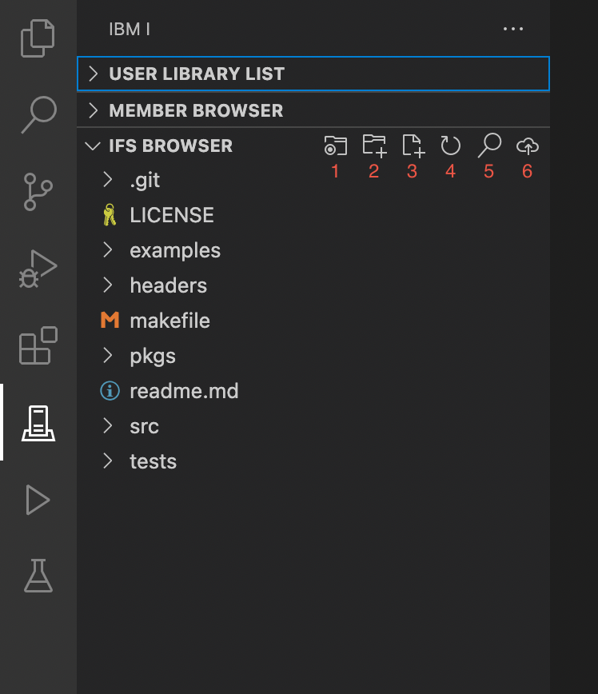

#

## Additonal IFS tips

Of course, the IFS Browser can do a lot more than browse and edit streamfiles.

1. change the working directory / home directory.
2. create a new directory
3. create a new editable streamfile
4. refresh the listing in the IFS Browser
5. search content in the working directory
6. upload a file to the working directory
