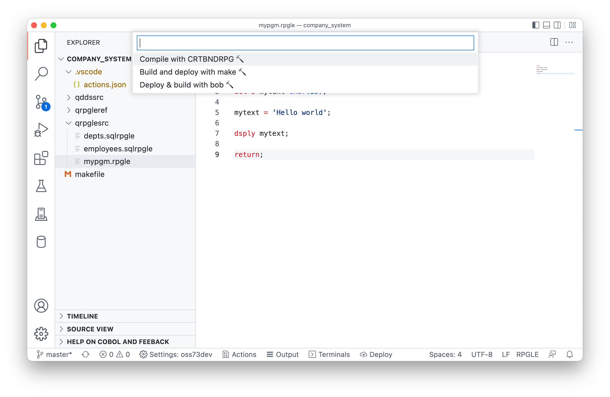
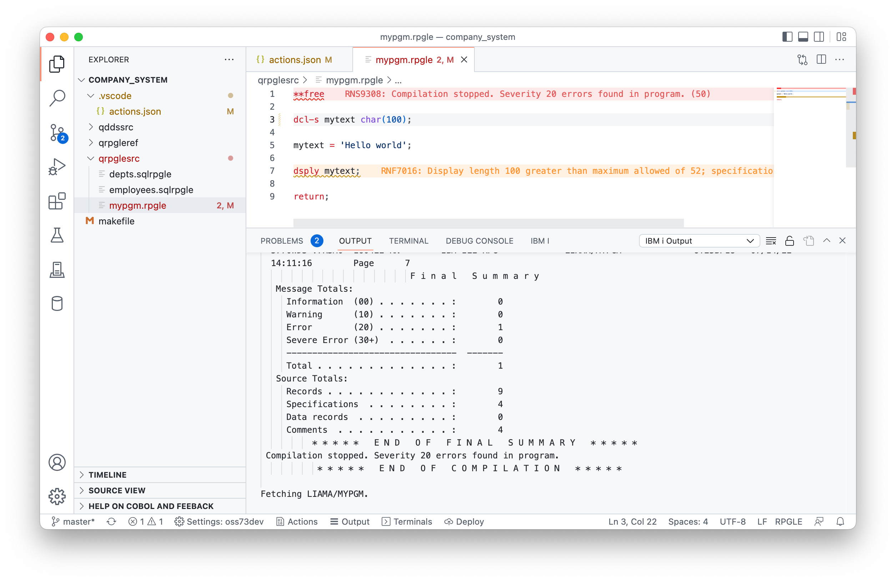

#

## Running an Action / compiling code

You can use the Control / Command + E shortcut to run an Action when you have opened some source code. This will prompt all available Actions for the current source.

Selecting an Action with `deployFirst` as `true` will ask you which files you want to deploy:

* All: deploy all sources from my local machine
* Working changes: deploy my working changes (when git is used)
* Staged changes: deploy my staged changes (when git is used)

You should do 'All' for the first time, and then when you're confident the source is on the server you can use Working or Staged changes.

You can see what happened from the Action being run here:

1. it set the working home directory to the Deploy directory on the IFS
2. It uploaded files to that directory
3. It failed to run the command. You can click on Show Output to see the job log and spool file if there is one.

If there are any source errors, you will see them appear in the editor. **This requires \*EVENTF on the Action command**.