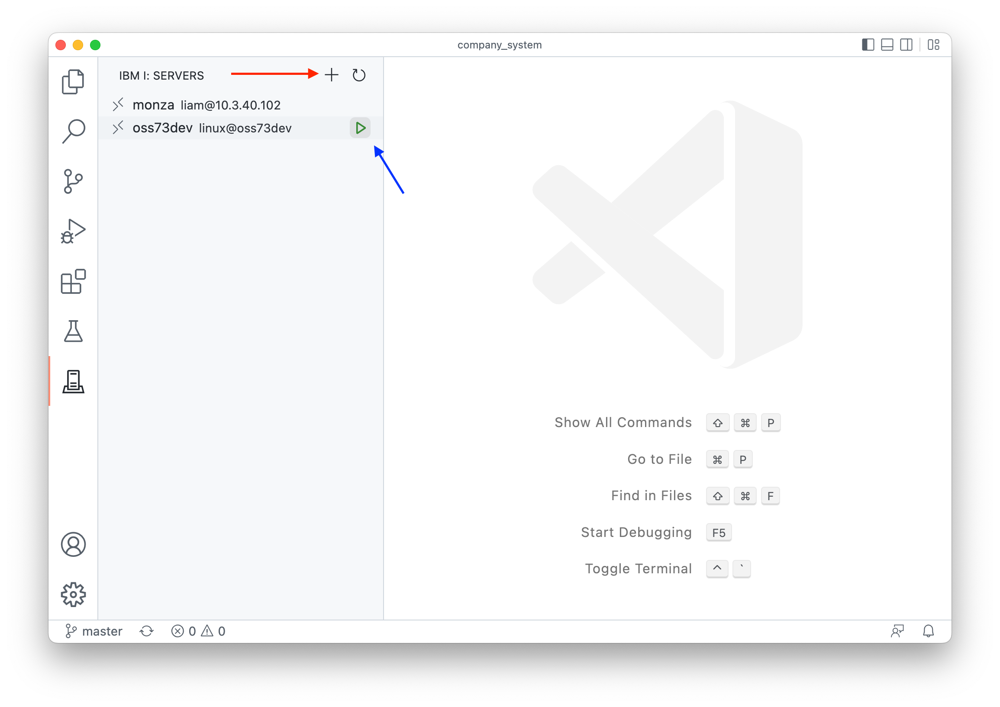
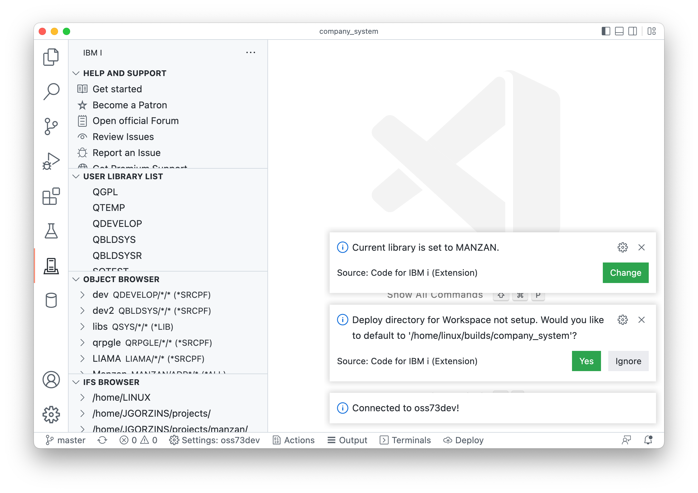

#

## Get connected

The next step is to get connect to the system where you want to compile your code. Head over to the Code for IBM i tab and either connect to a new system (red arrow) or connect to an existing one (blue arrow).

The first time you connect with a folder / workspace open, it will give you two notices.

* What your current library is. You can click Change to change it to the library you want to build your objects in. This is usually your own developer library.
* If you'd like to use a default location to upload your local sources to (the 'Deploy directory'). It defaults a builds folder in the standard home directory for a user. You should select Yes. You can change this later if you wanted to.pop

