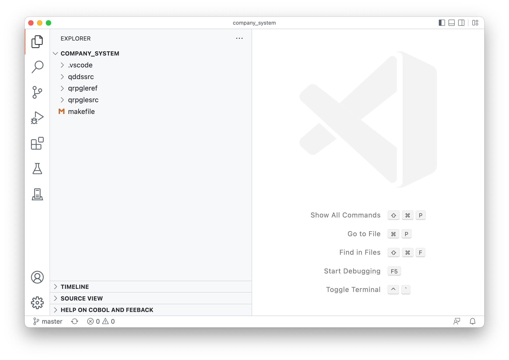

#

## Local development

Code for IBM i allows users to write code locally and build on the remote IBM i that you are connecting to.

## Open local workspace

The first step is to [open a folder](command:workbench.action.files.openFolderViaWorkspace) inside of VS Code.

If you opened the folder correctly, you should see the directories from the Explorer in VS Code like in the screenshot below.

