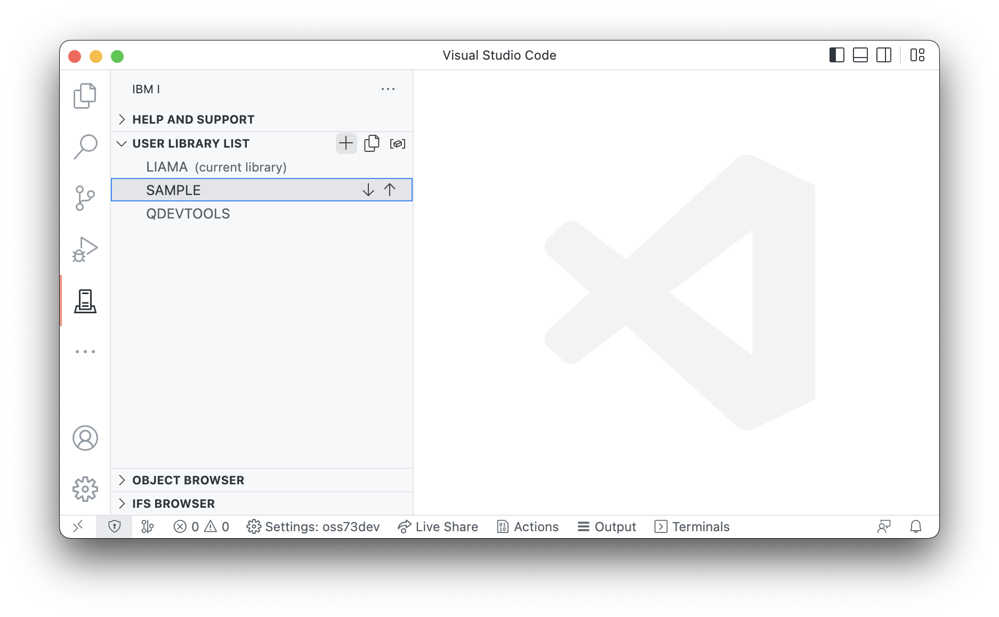

#

## Managing your library list

In the User Library List view, you can add, remove, and move libraries up or down in the list. This list is the library list that is used  whenever you run an Action.

You can:

* add items to the library list with the + (PLUS) icon.
* move items up or down by clicking on the item and using the arrows.
* remove items by right clicking on them.

The current library is marked. To change the current library:

1. right click on it and select the change option
2. click on the icon that appears inline with the current library