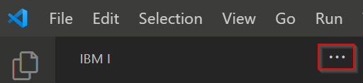

#

## Managing your library list

In the User Library List view, you can add, remove, and move libraries up or down in the list. This list is the library list that is used  whenever you run an Action.

If you don't see the User Library List iew, click the three dots:

---

---

You can:

* add items to the library list with the + (PLUS) icon.
* move items up or down by clicking on the item and using the arrows.
* remove items by right clicking on them.
