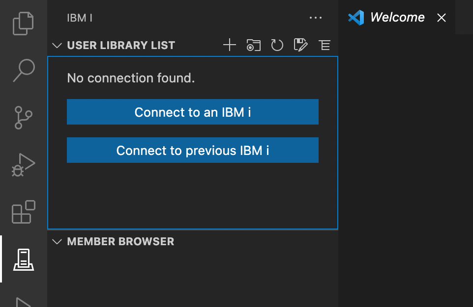

#

## Get connected

To connect to an IBM i, you need at least:

* The IP address or the hostname of the system
* Your user profile name
* Either a password or a SSH key

Code for IBM i connects to the system over SSH, so the SSH Daemon must be started on your IBM i.

[Connect to an IBM i](command:code-for-ibmi.connect) or [Connect to previous IBM i](command:code-for-ibmi.connectPrevious).
