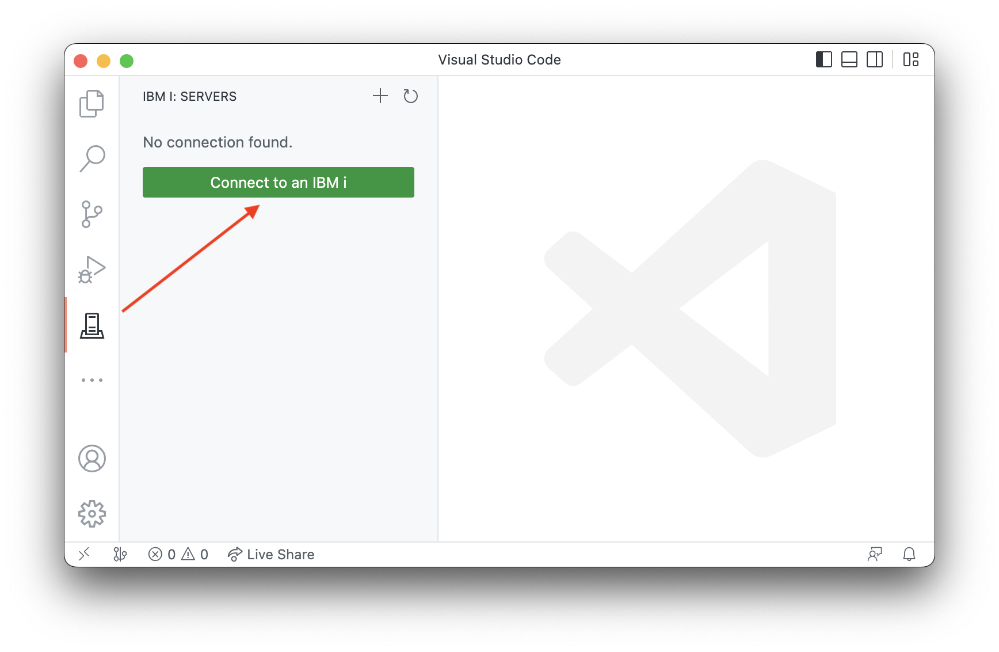
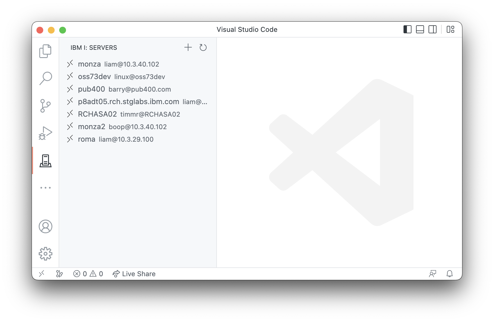

#

## Get connected

To connect to an IBM i, you need at least:

* The IP address or the hostname of the system
* Your user profile name
* Either a password or a SSH key

Code for IBM i connects to the system over SSH, so the SSH Daemon must be started on your IBM i.

After you install the Code for IBM i extension click the IBM i icon in the side bar.  If you have not created any connections before, you will see the connection to IBM i button:

When creating a new connection, a new tab will appear when you can provide the connection details for that system.

## Managing connections

Next time you launch VS Code, the previously saved or used connections will show. Selecting one will attempt to connect to it. Pressing the plus (+) button in the view header will allow you to add a new connection.

You can right click on any of the connections to later the login details or the connection settings.