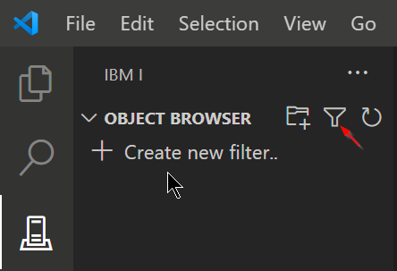
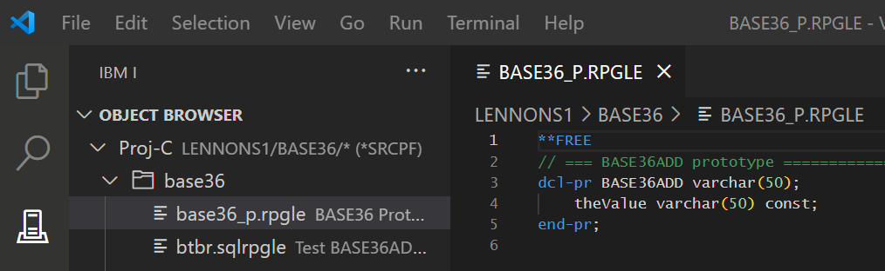

#

## Opening and viewing source code

In the side Bar find the OBJECT BROWSER:

Create a new filter for source file on which you want to work.

1. Click on **+ Create new filter** or on the filter icon.

2. Complete the new filter dialog. Follow the explanatory text that explains the options, ensuring:

   a. The Object is the source physical file you want to edit.

   b. The Object type filter is set to *SRCPF.

3. **Save settings**

4. Click on the filter to expand the members in the source file.

5. Click on a source member to open it.

Results should look like this:

