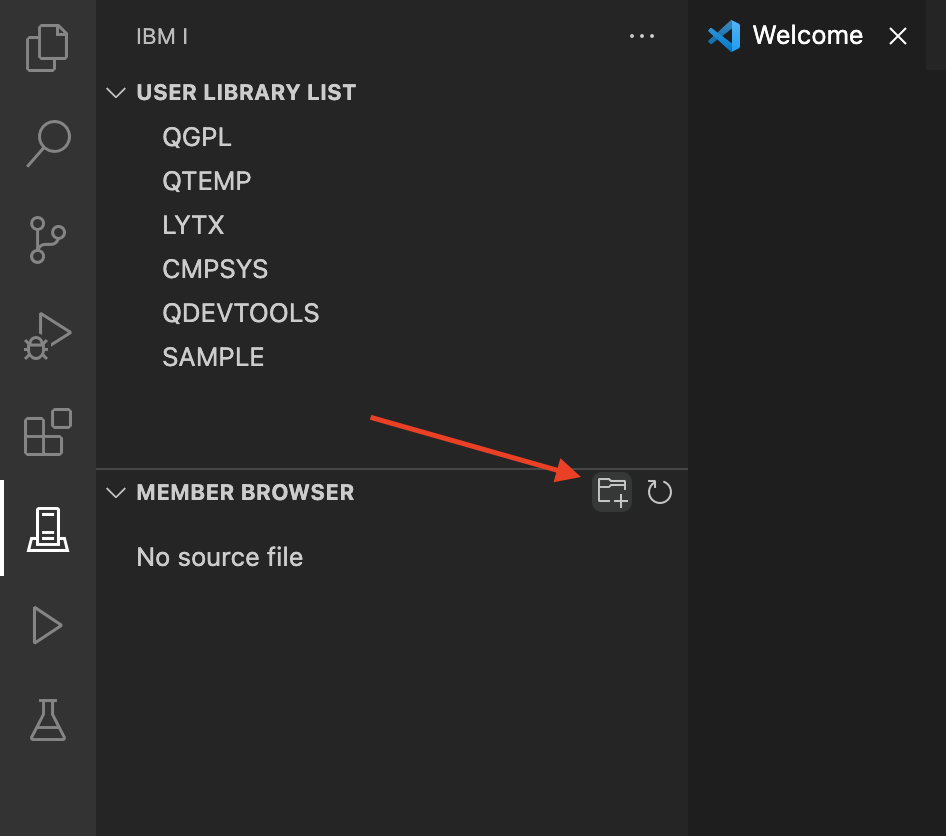

#

## Opening and viewing source code

Opening source members is easy. There is a view called the Member Browser and inside of this view is a list of source files. You will want to add your source file(s) to the list.

1. Add a source file to the Member Browser using the add button (the folder with the plus icon). When  asked for the source file, enter it in library/srcpf format. Examples:

   * `YOURLIB/QRPGLESRC`
   * `OTHERLIB/QDDSSRC`

2. When the source file has been added, you can click on it and that will load a list of members inside of the source file.

3. Next, you can click on a source member to open it.
