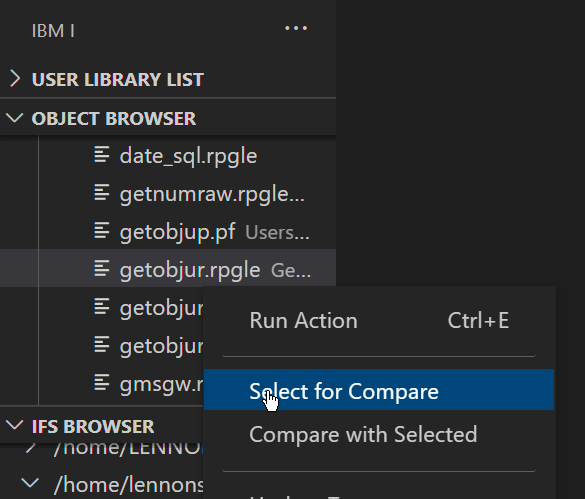
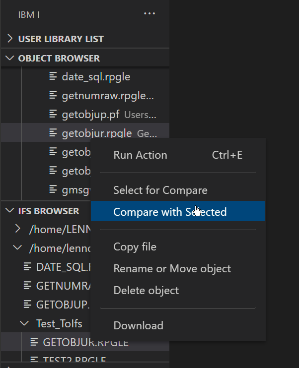

#

# Comparing two sources

Did you know you can compare two sources with each other with simple right click options? This works on source members and streamfiles.

## Select the base file

Right click on the source member or streamfile you want to compare and choose 'Select with compare'

## Select the file to compare with

Right click on the second source member or streamfile you want to compare the base file with and choose 'Compare with selected'

