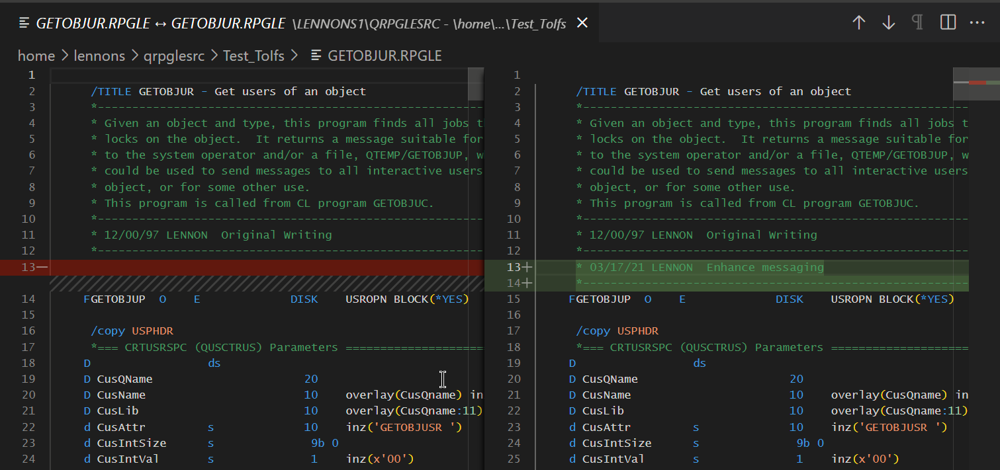

#

## Comparing two sources

Compare two sources with simple right click options. Either source can be a member or a streamfile.

## Select the base file

Right click on the source member or streamfile you want to compare and choose 'Select for compare'

## Select the file to compare with

Right click on the second source member or streamfile and choose 'Compare with selected'

## See differences

