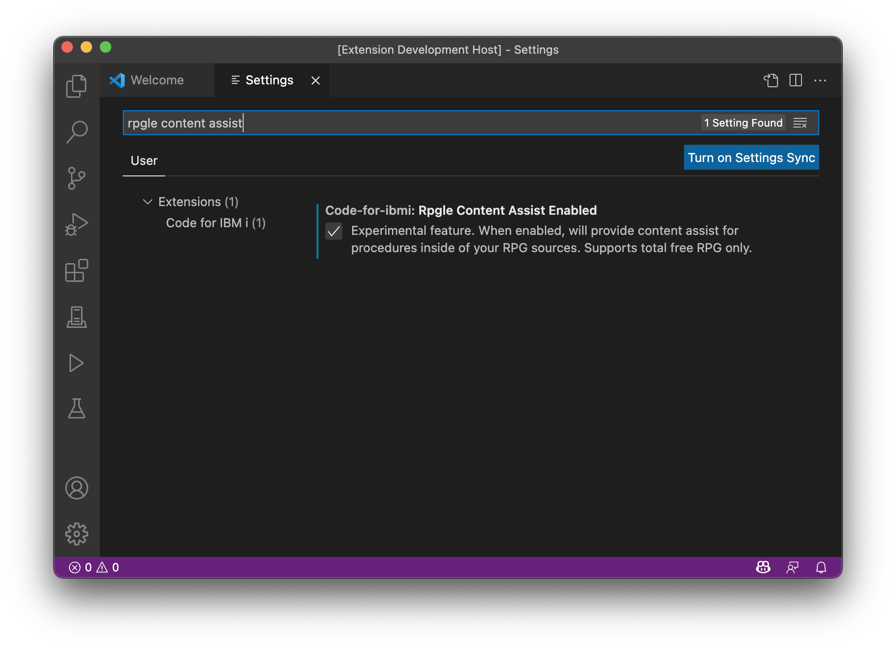

#

# RPGLE content assist

Code for IBM i does ship with content assist for RPGLE, but is disabled by default.

Content assist for RPGLE only works for total free-format source code (`**FREE`).

To enable the content assist, [open the VS Code Settings](command:workbench.action.openSettings) and search for 'rpgle content assist'.



Next, to test it, create a new source member (or streamfile) with the following content:

```rpgle
**FREE

Ctl-Opt DFTACTGRP(*NO);

Dcl-S text char(20);

text = 'Hello world';

// try the content assist here!

return;

Dcl-Proc addWorld;
  Dcl-Pi addWorld Varchar(20);
    base varchar(20) const;
  End-Pi;

  return %trim(base) + ' world!';
End-Proc;
```

You should use Control+Space to prompt the content-assist, and you should see the `addWorld` procedure on the list.

