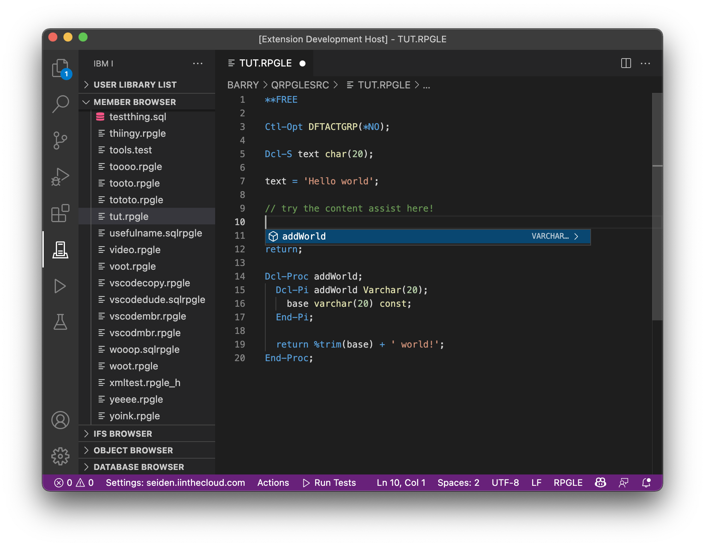

#

## RPGLE content assist

We also ship a seperate extension to add RPGLE language tools. Can you find it on the [Marketplace here](https://marketplace.visualstudio.com/items?itemName=HalcyonTechLtd.vscode-rpgle).

To test it, create a new source member (or streamfile) with the following content:

```rpgle
**FREE

Ctl-Opt DFTACTGRP(*NO);

Dcl-S text char(20);

text = 'Hello world';

// try the content assist here!

return;

Dcl-Proc addWorld;
  Dcl-Pi addWorld Varchar(20);
    base varchar(20) const;
  End-Pi;

  return %trim(base) + ' world!';
End-Proc;
```

Use Control+Space to invoke content assist, and you should see the `addWorld` procedure on the list.


