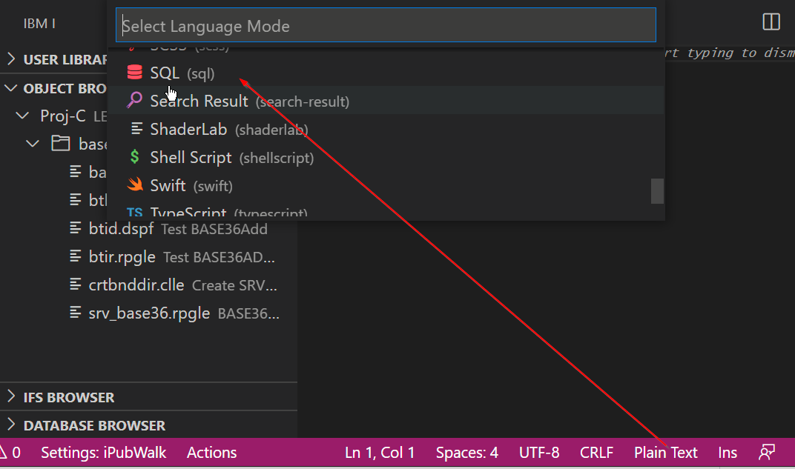

#

## Running SQL statements

**For this to work, you must install the [Db2 for IBM i extension](https://marketplace.visualstudio.com/items?itemName=HalcyonTechLtd.vscode-db2i).**

When working with SQL files you can highlight an SQL statement and exeute it from within the editor.

### SQL in a file

1. Open any source member or streamfile with the `sql` extension
2. Highlight the statement you want to execute
3. Press Control + R / Command + R to execute the selected statement.

### Adhoc SQL

If you just want to run or test a statement, try this:

1. Create a new file (Control + N / Command + N)
2. Change the file language to SQL (highlighted in the image)
3. Write and highlight the statement
4. Press Control + R / Command + R to execute the selected statement.



### SQL processors

Newer version of SQL provided by Db2 for i allows you to run CL commands in a script. There are also `json` and `csv` processors, which will open the result set in the chosen format.

```sql
-- result set as normal table
select * from sample.employee;

-- result set as JSON, will open in a new file
json: select * from sample.employee;

-- result set as CSV, will open in a new file
csv: select * from sample.employee;

-- run CL commands. output is directed to IBM i output channel
cl: dspffd sample/employee
```