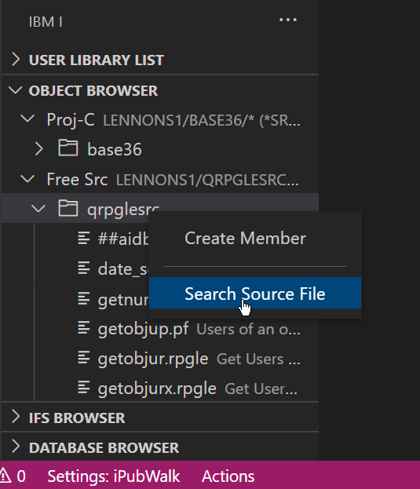
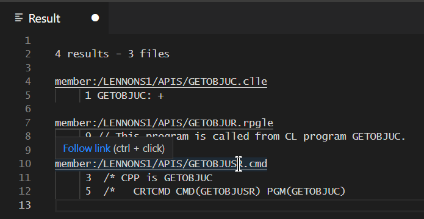
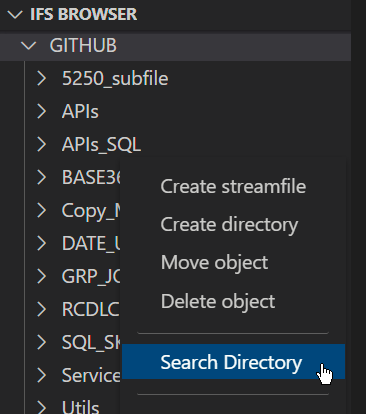

#

## Searching source members

Right click on a source file in the Member Browser and select 'Search Source File'. It will prompt for a search string.

Search results load in a new tab.

Control+Click on the link to open the member.

## Searching Streamfiles

Right click on a directory in the IFS Browser and select 'Search Directory'.

Proceed as with a source file search.
