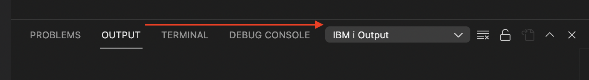

#

# Spool files

It's possible to view the spool files from Actions that you run. First, you have to enable a specific setting and then find where to view the spool file.

## Enable the settings

To tell Actions to show the spool file output, [open the VS Code Settings](command:workbench.action.openSettings) and search for 'compile output'.

Make sure the setting is enabled.

## Viewing the spool output.

Open the Output tab, which shows in the windows at the bottom of VS Code. If the window is not open, you can open it with Control + J / Command + J.

The window has 4 tabs. You should select the 'Output' tab and then in the dropdown to the right select 'IBM i Output'. This is where the spoolfiles are logged in.

